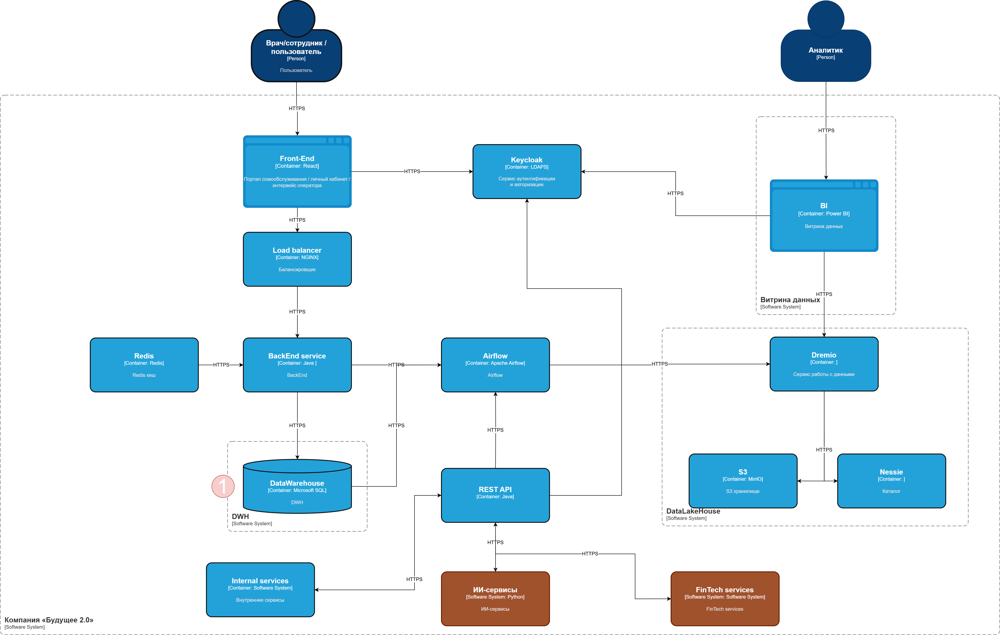

[на главную](../README.md) | [задание 2](../Task2/README.md)

---

# Задание 1

## Задание 1.1 - архитектура to-be

[Диаграмма контейнеров](./c4-container-to-be.drawio.png)

Примечания:
1. хоть и выбран Microsoft SQL Server в качестве хранилища (DWH), так как он уже есть в стеке.Лучше бы подумать в сторону дальнейшей миграции в Postgres в связке с Clickhouse. Сам DWH работает на Postgres (все вот это: факты, классификаторы, "звезды", "снежинки"), а если надо что-то побыстрей для выборки данных, то создавать витрины данных на Clickhouse(в денормализованном виде).

## Задание 1.2 - проблемные места

- Устаревший DWH: Старый DWH на старой версии SQL Server 2008. (необходимо обновление из-за окончания поддержки 09.07.2019, проблемы с безопасностью)
- Низкая скорость построения отчетов: Большие объемы данных в DWH, отсутстуие, нет доменов и все данные в одном DWH
- Отсутствие разделения на модули: Без разделения на домены не получится безболезненно масштабировать и модифицировать систему.

## Задание 1.3 - приоритеризация по MoSCoW

## Must
- Устаревший Microsoft SQL Server 2008.
- Медленная генерация отчетов из-за большого объема данных.
## Should
- Устаревшая интеграционная шина на Apache Camel.
## Could
- Сложность внесения изменений (отсутствие деления на домены)
## Wold
- Аналитика данных (В текущем варианте две системы, одна для оперативных данных, другая для отчетов - добавить отчеты на портал)

---

[на главную](../README.md) | [задание 2](../Task2/README.md)

