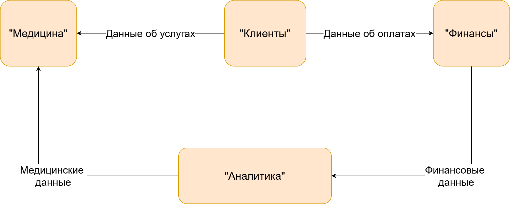

[на главную](../README.md) | [задание 3](../Task3/README.md) | [задание 1](../Task1/README.md)

---

# Задание 2

## 2.1 Основные домены  

- Домен "Клиенты": Управление взаимодействием с клиентами, включая хранение данных о них, историю взаимодействий и обслуживание;
- Домен "Медицина": Медицинские карты, истории болезней, данные исследований;
- Домен "Финансы": Финансовая история клиентов, счета, данные по кредитам;
- Домен "Аналитика": Витрина данных для самообслуживания, централизованная аналитика.

## 2.2 Потоки данных

[Диаграмма Потоков данных](./data_flow_diagram.drawio)

## 2.3 Обоснование

### 2.3.1 Модульность  
Разделение системы на модули при использовании Domain-Driven Design (DDD) является важным подходом для повышения гибкости и масштабируемости итоговой системы. Это позволяет разбить сложную систему на логически связанные компоненты, каждый из которых отвечает за определенную часть бизнес-логики. Благодаря такой модульности, разработчики могут работать над отдельными модулями независимо, что ускоряет процесс разработки и упрощает внесение изменений. Например, если требуется обновить функциональность одного модуля, это не повлияет на работу других, что снижает риски возникновения ошибок и упрощает тестирование. Кроме того, модульная структура облегчает поддержку системы, так как каждый модуль можно анализировать и улучшать отдельно. Это также способствует более четкой организации кода и улучшает его читаемость, что особенно важно для крупных проектов с большим количеством разработчиков. В итоге, использование DDD и модульного подхода делает систему более адаптивной к изменениям бизнес-требований и технологическим обновлениям.

### 2.3.2 Масштабируемость  
Разделение системы на модули является мощным инструментом для организации сложных проектов, так как оно позволяет каждому направлению или функциональному блоку развиваться автономно. Это означает, что команды, работающие над разными модулями, могут принимать решения и внедрять изменения, не завися от других частей системы. Например, если один модуль отвечает за обработку платежей, а другой — за управление пользователями, то обновления в платежном модуле не потребуют изменений в модуле пользователей. Такая независимость значительно ускоряет процесс разработки и упрощает масштабирование, так как каждый модуль можно расширять или оптимизировать в соответствии с его конкретными требованиями. Кроме того, это снижает риски возникновения конфликтов в коде и упрощает тестирование, так как изменения изолированы в рамках одного модуля. В результате система становится более гибкой, устойчивой к изменениям и готовой к росту, что особенно важно в условиях быстро меняющихся бизнес-требований.

### 2.3.3 Безопасность  
Разделение данных по доменам с использованием ролевых моделей доступа является эффективным подходом к повышению безопасности системы. Такой метод позволяет четко определить, какие пользователи или системы имеют доступ к конкретным данным и функциональности в рамках каждого домена. Например, если система разделена на домены, такие как управление финансами, работа с клиентами или логистика, то для каждого из них можно создать отдельные ролевые модели, которые будут ограничивать доступ только для авторизованных пользователей. Это минимизирует риски утечки данных или несанкционированного доступа, так как каждый пользователь сможет взаимодействовать только с той информацией, которая необходима для его задач. Кроме того, такой подход упрощает аудит и мониторинг безопасности, поскольку действия пользователей ограничены их ролями и доменами. В случае изменений в бизнес-процессах или структуре данных, ролевые модели можно легко адаптировать, не затрагивая всю систему. Таким образом, разделение данных по доменам и использование ролевого контроля доступа не только повышает безопасность, но и делает систему более гибкой и управляемой.

---

[на главную](../README.md) | [задание 3](../Task3/README.md) | [задание 1](../Task1/README.md)
