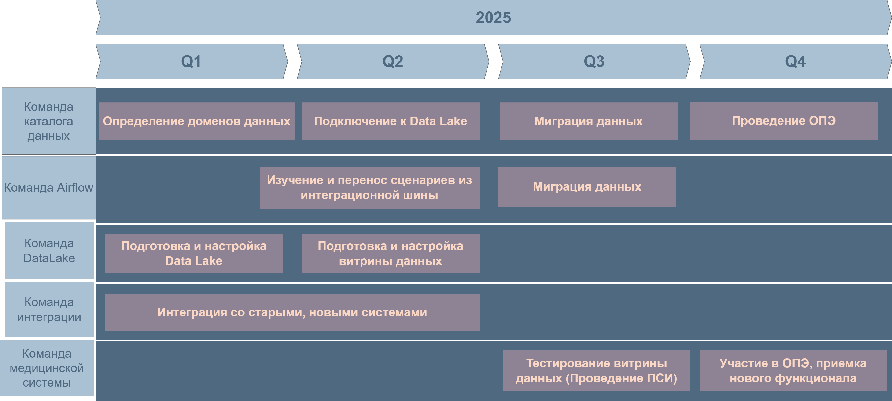

[на главную](../README.md) | [задание 2](../Task2/README.md)

---

# Задание 3

## 3.1 Обоснование причин внесения изменений  

- Внедрение витрины данных – обеспечение быстрого построения отчетов.  
- Улучшение масштабируемости системы – повышение гибкости системы.
- Отказ от устаревших технологий – Повышение надежности и безопасности.  

## 3.2 Технический радар  

### 3.2.1 **Adopt (Рекомендуется к использованию)** 
- Java  
- React  
- Keycloak 
- Redis  
#### Дополнительно  
- PostgreSQL - на схемах нет, но нужна БД приложения  
- Grafana / Prometheus - потребуется мониторинг.  

### 3.2.2 **Trial (На этапе тестирования)**  
- MinIO
- Nessie  
- Dremio  

### 3.2.3 **Assess (Оценка перспективности)**  

- Apache Airflow  

### 3.2.4 **Hold (Устаревшие, планируются к замене)**  
- Microsoft SQL Server 2008  
- Power Builder  
- Apache Camel  

[Попробовал визуализировать](https://radar.thoughtworks.com/?documentId=https%3A%2F%2Fraw.githubusercontent.com%2Ftocorin%2Fya_architecture-sprint-11%2Frefs%2Fheads%2Fsprint_11%2FTask3%2Fradar.csv)

## 3.3 Дорожная карта

[дорожная карта](./roadmap.drawio)

---

[на главную](../README.md) | [задание 2](../Task2/README.md)